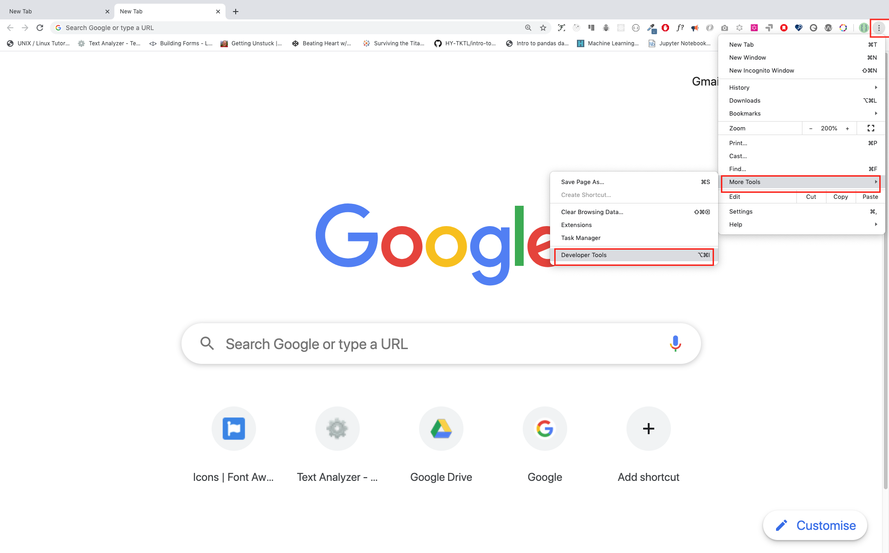

## installing node

```bash

## first install nvm


```

#### Google Chrome


#### Opening Google Chrome Console



To open the Chrome console using a keyboard shortcut.

```sh
Mac
Command+Option+J

Windows/Linux:
Ctl+Shift+J
```


#### Writing Code on Browser Console

We can write any JavaScript code on the Google console or any browser console. However, for this challenge, we only focus on Google Chrome console. Open the console using:

```sh
Mac
Command+Option+I

Windows:
Ctl+Shift+I
```

##### Syntax


