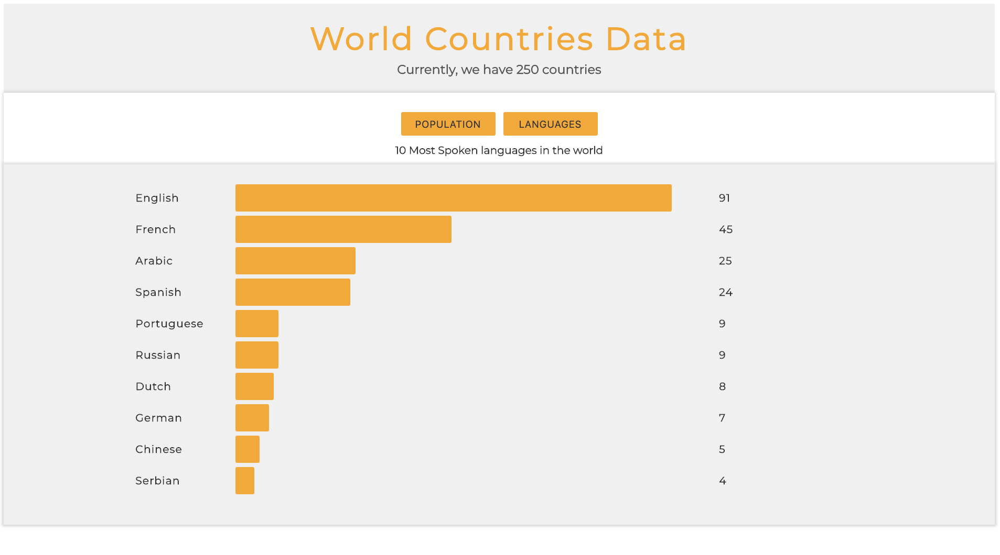

- [Day 25](#day-25)
  - [Exercises](#exercises)
    - [Exercise: Level 1](#exercise-level-1)

# Day 25

## Exercises

### Exercise: Level 1

1. Visualize the ten most populated countries and the ten most spoken languages in the world using DOM(HTML, CSS, JS)

