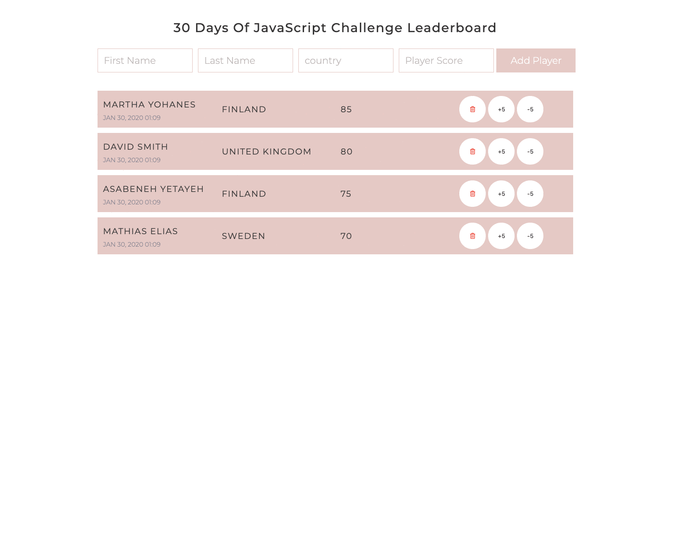

- [Day 28](#day-28)
  - [Exercises](#exercises)
    - [Exercise: Level 1](#exercise-level-1)

# Day 28

## Exercises

### Exercise: Level 1

1. Create the following using HTML, CSS, and JavaScript

